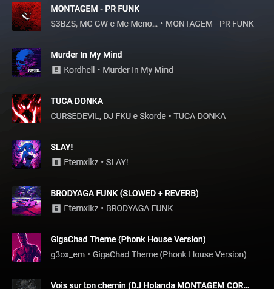
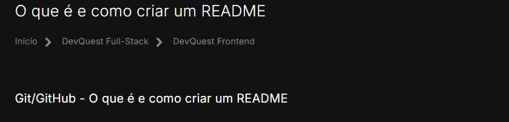

# Protejo com README
um projeto de teste com um arquivo README 🎈

[    ]

## Tecnologia utilizadas
- HTML
- CSS
- JS

## Como utlizar

1 - Clone para o projeto
```

git clone <https://www.twitch.tv/>
```

2 - Acesso a pasta do proejto
```

cd repositorio-com-readme
```